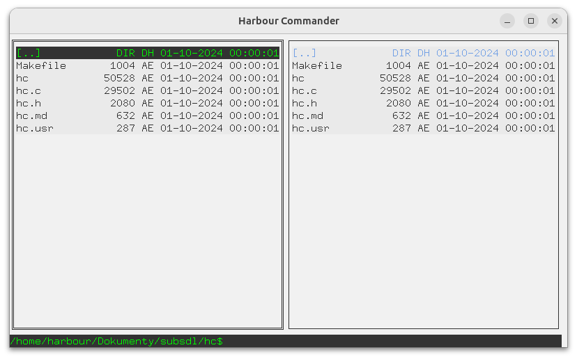

# Harbour Commander

`Harbour Commander` is a lightweight, cross-platform file manager featuring a dual-pane interface. It is designed for speed and ease of use.

### Example

File manager [hc.c](hc.c)



### To build and run hc:

- First, build a library [GT](../docs/README.md)

- MSYS2
   ```
   cd hc/
   make
   ```
   or:
   ```
   gcc hc.c -o hc -I ../include -L ../lib -lmingw32 -lgt -lSDL2main -lSDL2

- Linux
   ```
   cd hc/
   make
   ```
   or:
   ```
   gcc hc.c -o hc -I ../include -L ../lib -lgt -lSDL2
   ```
---
